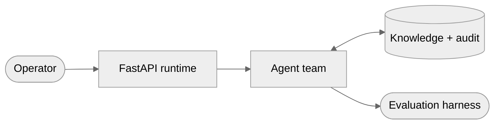

<div align="center">

# Agentic AI Orchestration Platform

**Multi-agent runtime on a plan-retrieve-act-critique loop · full tool-call trace on every run · frozen 150-case eval suite**


[Case study](https://www.shivamsfolio.com/projects/agentic-ai-orchestration-platform) · [Claims ledger](CLAIMS.md) · [Series](#part-of-a-series)

</div>

---

> [!IMPORTANT]
> **No code yet — 0 of 9 milestones.** `87% success · 150 eval cases` is a target, not a measurement.
>
> A self-authored suite is only worth what ships with it: the cases, the grader, the raw runs and an interval. At n=150 the Wilson 95% band around 87% is roughly [81%, 92%], so a point estimate is not precision. Every number lands in [CLAIMS.md](CLAIMS.md) first, with its commit, host and caveat.

## Problem

Make knowledge-work requests repeatable and auditable — the reasoning trace and tool activity stay visible rather than collapsing into an answer.

## Architecture



| Stage | | Detail |
|---|---|---|
| **Operator** | `in` | React workspace |
| **FastAPI runtime** | `work` | task API · WebSocket trace stream |
| **Agent team** | `work` | plan · retrieve · act · critique, under a hard step budget |
| **Knowledge + audit** | `state` | Weaviate/Pinecone · Postgres checkpoints |
| **Evaluation harness** | `out` | per-stage attribution · replay |

## Scope

**Specialised agent loop.** Planner, retriever, executor and critic take real turns over shared task state through explicit tool-calling contracts.

**Safe recovery.** A sandboxed execution loop captures failed actions as structured evidence, the critic proposes a correction, and retries stop exactly where policy says.

**Governance surface.** WebSocket events stream live traces to React; Postgres persists inputs, tools, outputs and checkpoints so any historical run reconstructs exactly.

## Roadmap

`[░░░░░░░░░░░░░░░░░░░░░░░░] 0/9` — ticked only when the verification step passes, not when the code is written.

- [ ] **M1 · Walking skeleton: one agent, one trace** — a task over HTTP runs a tool-calling agent to completion; every decision is queryable afterwards.
- [ ] **M2 · Live trace console over WebSockets** — every model decision and tool call appears in a browser as it is emitted, not after the fact.
- [ ] **M3 · Knowledge plane and a retrieve tool that cites** — every retrieved chunk is attributable to a source span from the trace alone.
- [ ] **M4 · The four-agent loop** — planner, retriever, executor and critic over shared state, explicit contracts, hard step budget.
- [ ] **M5 · Sandboxed execution and bounded recovery** — failures captured as evidence; the critic corrects; retries stop where policy says.
- [ ] **M6 · Evaluation harness and smoke suite** — any prompt or loop change scored the same way twice, with cost and per-stage failure attribution.
- [ ] **M7 · core-150 and the number** — a frozen suite with a calibrated grader produces a success rate defensible to someone who has read the code.
- [ ] **M8 · Replay, checkpoints, governance** — any historical run reconstructs exactly, and nothing sensitive reaches the record.
- [ ] **M9 · Ship it** — one-command bring-up, CI, and the four advertised commands working from a clean clone.

Grading is split deliberately: programmatic assertions wherever the answer is checkable — citation resolvable, tool called, sandbox exit code, structured field match — and an LLM-judge rubric only where it genuinely is not. The split gets published, because a suite that is 90% judge-graded is measuring the judge.

## Stack

`Python 3.12 + uv` `FastAPI + Pydantic v2` `Anthropic Python SDK (claude-opus-5 tool calling, prompt caching)` `SQLAlchemy 2 + Alembic` `PostgreSQL 16` `Weaviate + Pinecone behind one store interface` `WebSockets` `React 19 + Vite + TypeScript` `Docker Compose` `pytest + ruff + mypy` `GitHub Actions`

## Commands

Not runnable yet. This is the shape it is aiming for — the commands the [case study](https://www.shivamsfolio.com/projects/agentic-ai-orchestration-platform) publishes:

```bash
cp .env.example .env && docker compose up -d postgres weaviate      # 1. model + storage
uv sync && uv run alembic upgrade head && uv run fastapi dev app/main.py  # 2. runtime
cd web && npm install && npm run dev                                # 3. trace console
uv run python -m evals.run --suite core-150                         # 4. evaluate
```

## Part of a series

Seven systems projects, built one at a time. This is **#3**.

| # | Project | Repo |
|---|---|---|
| 01 | Low-Latency Market Data & Order Entry Stack | [`low-latency-market-data-stack`](https://github.com/Git-ShivamPatil/low-latency-market-data-stack) |
| 02 | Distributed Rate Limiter & API Gateway | [`distributed-rate-limiter-gateway`](https://github.com/Git-ShivamPatil/distributed-rate-limiter-gateway) |
| 03 | **Agentic AI Orchestration Platform** *(you are here)* | — |
| 04 | High-Performance LLM Inference Server | [`rust-llm-inference-server`](https://github.com/Git-ShivamPatil/rust-llm-inference-server) |
| 05 | Secure Banking System | [`fabric-banking-platform`](https://github.com/Git-ShivamPatil/fabric-banking-platform) |
| 06 | Online Examination System | [`online-examination-system`](https://github.com/Git-ShivamPatil/online-examination-system) |
| 07 | Secure RAG with RBAC, Guardrails & Monitoring | [`secure-rag-rbac`](https://github.com/Git-ShivamPatil/secure-rag-rbac) |

Plus [`bfsi-lending-lakehouse`](https://github.com/Git-ShivamPatil/bfsi-lending-lakehouse) — a medallion lakehouse shipped outside the series. All published on [shivamsfolio.com](https://www.shivamsfolio.com/projects).

## Licence

[MIT](LICENSE) © Shivam Patil

---

<div align="center">

**[Case study](https://www.shivamsfolio.com/projects/agentic-ai-orchestration-platform)** · **[All projects](https://www.shivamsfolio.com/projects)** · **[Contact](https://www.shivamsfolio.com/contact)**

</div>
