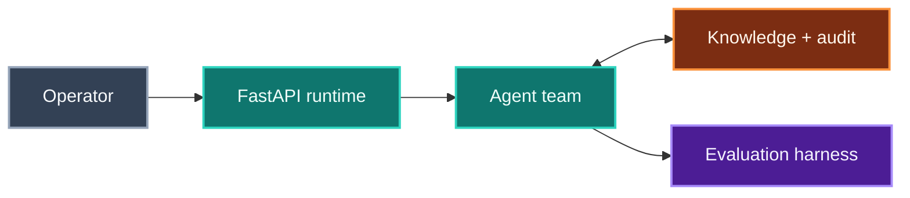

<div align="center">

# Agentic AI Orchestration Platform

**Multi-agent runtime on a plan-retrieve-act-critique loop, emitting a full decision and tool-call trace on every run.**


   

[Case study](https://www.shivamsfolio.com/projects/agentic-ai-orchestration-platform) · [Claims ledger](CLAIMS.md) · [All 7 projects](#part-of-a-series)

</div>

---

> [!IMPORTANT]
> **This is a build in progress — 0 of 9 milestones complete.**
>
> The target figure below (`87% success · 150 eval cases`) is a **goal, not a measurement.** Nothing here has been benchmarked yet.
> Every number this project eventually publishes will land in [CLAIMS.md](CLAIMS.md) first, with the commit it was measured at,
> the hardware it ran on, and the caveat that matters. If it is not in that file, it has not been measured.

## The problem

Make knowledge-work requests repeatable and auditable — the reasoning trace and tool activity stay visible rather than collapsing into an answer.

## How it fits together



| Stage | | What it does |
|---|---|---|
| **Operator** | `in` | React workspace |
| **FastAPI runtime** | `work` | tasks · WebSockets |
| **Agent team** | `work` | plan · retrieve · act · critique |
| **Knowledge + audit** | `state` | Vector DB · Postgres |
| **Evaluation harness** | `out` | quality · replay |

<sub>Conceptual architecture. Colour carries meaning, and it means the same thing across all seven projects in this series: **grey** is what comes in, **teal** is where the work happens, **amber** is state that outlives a request, **violet** is what comes out.</sub>

## What is being built

**Specialised agent loop.** Planner, retriever, executor, and critic agents share task state and take turns through explicit tool-calling contracts.

**Safe recovery.** A sandboxed execution loop captures failed actions, lets the critic propose corrections, and bounds retries with policy checks.

**Governance surface.** WebSocket events stream live traces to React; PostgreSQL persists inputs, tools, outputs, and checkpoints for replay.

## Roadmap

Each milestone is independently demoable and ends in a commit. A box is ticked only when its verification step actually passed — not when the code was written.

```
[░░░░░░░░░░░░░░░░░░░░░░░░] 0/9 milestones · 0%
```

- [ ] **M1 · Walking skeleton: one agent, one trace**  
  A task submitted over HTTP runs a single tool-calling agent to completion, and every decision it made is queryable afterwards.
- [ ] **M2 · Live trace console over WebSockets**  
  You can watch a run happen — every model decision and tool call appears in a browser as it is emitted, not after the fact.
- [ ] **M3 · Knowledge plane and a retrieve tool that cites**  
  The agent can ground answers in a real corpus, and every retrieved chunk is attributable back to a source span from the trace alone.
- [ ] **M4 · The four-agent loop**  
  Planner, retriever, executor and critic take real turns over shared task state under explicit tool contracts and a hard step budget.
- [ ] **M5 · Sandboxed execution and bounded recovery**  
  A tool call that fails is captured as structured evidence, the critic proposes a correction, and retries stop exactly where policy says they stop.
- [ ] **M6 · Evaluation harness and a smoke suite**  
  Any change to a prompt or the loop can be scored the same way twice, with cost and per-stage failure attribution attached.
- [ ] **M7 · core-150 and the number**  
  A frozen 150-case suite with a calibrated grader produces a success rate you would defend to someone who has read the code.
- [ ] **M8 · Replay, checkpoints and governance**  
  Any historical run can be reconstructed exactly, and nothing sensitive ever reaches the record.
- [ ] **M9 · Ship it: one-command bring-up, CI, and page parity**  
  A stranger can clone the repo, run the four commands the portfolio page advertises verbatim, and get the system the page describes.

## On the performance target

| | |
|---|---|
| **Target** | `87% success · 150 eval cases` |
| **Measured so far** | nothing — see [CLAIMS.md](CLAIMS.md) |
| **Feasibility** | `yes-with-caveats` |

<details>
<summary><b>What it would actually take to hit this honestly</b></summary>

Hardware is irrelevant to this number — every model call is a hosted API call and the local services (Postgres, Weaviate, CPU embeddings) run fine on the builder's Windows 10 + Docker box with 16GB RAM. No GPU, no special network. The number is a function of suite design, not silicon, which is exactly why it needs more caveating than a throughput claim, not less: 87% is trivially reachable on a suite you author yourself and trivially unreachable on someone else's. Legitimately substantiating it requires five things. (1) The 150 cases ship in the repo with inputs and expected outcomes, so a reader can check them. (2) A written grading contract: programmatic assertions wherever the answer is checkable (citation present and resolvable, tool called, sandbox exit code, structured field match), an LLM-judge rubric only where it genuinely is not — and the split stated, because a suite that is 90% judge-graded is measuring the judge. (3) Judge calibration: ~50 outputs hand-labelled, Cohen's kappa against the judge reported, and >= 0.7 or the judge is not a grader. (4) At least three full runs, reported as mean +/- spread, because a plan-retrieve-act-critique loop on claude-opus-5 is nondeterministic and a single lucky run is the most likely form of honest-looking dishonesty here. (5) The headline pinned to a model id, git SHA and date, with a Wilson 95% interval — at n=150, p=0.87 the interval is roughly [81%, 92%], about +/-5.5pp, so '87%' is a point estimate and the page's precision is not real precision. Also hold out ~30 cases you never inspect while tuning and report dev and held-out separately; if held-out lands materially below dev, the suite leaked. Cost: roughly $25-80 per full run on claude-opus-5 with prompt caching, halved via the Batch API — budget for 10-15 full runs plus continuous smoke runs, not for rerunning 150 cases every time you edit a prompt.

</details>

## Stack

- Python 3.12 + uv
- FastAPI + Pydantic v2
- Anthropic Python SDK (claude-opus-5 tool calling, prompt caching)
- SQLAlchemy 2 + Alembic
- PostgreSQL 16
- Weaviate (local) with a Pinecone backend behind one store interface
- WebSockets (native FastAPI)
- React 19 + Vite + TypeScript
- Docker Compose (WSL2 backend)
- pytest + ruff + mypy
- GitHub Actions

## How it will be run

Not runnable yet. This is the shape it is aiming for — the same commands the [case study](https://www.shivamsfolio.com/projects/agentic-ai-orchestration-platform) publishes:

**1. Configure model and storage.** Copy the example environment file and provide model, vector-store, and database credentials.

```bash
cp .env.example .env
docker compose up -d postgres weaviate
```

**2. Run the orchestration API.** Install Python dependencies, apply the schema, and start the FastAPI development server.

```bash
uv sync
uv run alembic upgrade head
uv run fastapi dev app/main.py
```

**3. Open the trace console.** Launch the React client and connect it to the WebSocket endpoint exposed by the API.

```bash
cd web && npm install && npm run dev
```

**4. Evaluate a task suite.** Run the harness against the pinned benchmark cases and compare success rate by agent stage.

```bash
uv run python -m evals.run --suite core-150
```

<details>
<summary><b>Planned repository layout</b></summary>

```
README.md — quickstart is the four portfolio commands, verbatim and actually working
pyproject.toml, uv.lock, .python-version
.env.example (ANTHROPIC_API_KEY, DATABASE_URL, WEAVIATE_URL, PINECONE_*, embedding provider, per-task cost cap)
docker-compose.yml (postgres, weaviate, embedding container; sandbox profile)
Makefile
app/ — main.py, settings.py, api/ (tasks, ws, health), agents/ (planner, retriever, executor, critic), orchestrator/ (turn policy, budgets, state), tools/ (contracts, registry, retrieve, sandbox_exec), trace/ (events, bus, redaction), store/ (weaviate.py, pinecone.py, base.py), db/ (models, session), replay.py
alembic/ + alembic.ini
evals/ — run.py, cases.py, graders/ (programmatic, judge), attribution.py, report/, retrieval.py, suites/{smoke-25,core-150}/
web/ — Vite + React + TypeScript trace console (src/, package.json, vite.config.ts)
sandbox/ — Dockerfile, runner.py, policy.yaml
corpus/ — ingest.py, docs/, gold.jsonl
tests/ — unit, integration, contract tests for both vector backends, fault-injection recovery tests
docs/ — ARCHITECTURE.md, BENCHMARKS.md, TRACE_SCHEMA.md, COSTS.md
.github/workflows/ci.yml (lint, types, tests, smoke evals behind a spend cap)
LICENSE, .gitignore, .dockerignore
```

</details>

<details>
<summary><b>Known risks going in</b></summary>

Written before a line of code, so they can be checked against what actually happened.

- The 87% is unfalsifiable unless the suite ships with it. The portfolio page states it as an outcome, which invites the reader to weigh it like the throughput numbers on the sibling projects — but a self-authored benchmark with no held-out split, no judge calibration and no published raw runs is a number nobody can check. This is the claim that is hardest to substantiate honestly, and the mitigation is not technical: commit the cases, the grader, the run logs and the interval, or soften the wording on the page.
- Point estimate vs. interval. At n=150 the Wilson 95% CI around 87% is roughly [81%, 92%]. Two honest runs of the same commit can straddle 87%. Reporting the one that landed on it is the most likely accidental dishonesty in this whole build; publish mean +/- spread over three runs instead.
- LLM-judge drift and self-grading. If the judge is another Claude call with a loose rubric, the 'success' definition is doing the work the agent is being credited for. Without a measured kappa against human labels the metric is decorative — and kappa costs real human hours that cannot be delegated to the AI pair.
- Eval cost creep. Naive full-suite reruns on claude-opus-5 during prompt tuning can run past $1000 across the build. Prompt caching, the 25-case smoke suite, haiku-4-5 for sub-roles and the Batch API are load-bearing, not optimizations — and none of them are things AI pairing speeds up, because the work is measurement and restraint.
- 'Sandboxed execution loop' has to mean your sandbox. Docker socket access from the API container on Windows 10 / WSL2, path translation, and resource caps are exactly the class of infra debugging AI pairing does not accelerate. If you fall back to the Anthropic code-execution server tool because local sandboxing fights you, the implemented bullet is still true but the sandbox is Anthropic's — say so in the README rather than letting the page imply otherwise.
- 'Pinecone / Weaviate' on the stack line reads as both. If only Weaviate is ever implemented, the slash is a claim you did not build. Either keep the two-backend store interface and its shared contract test genuinely passing against both, or narrow the stack line on the page.
- Retrieval quality is the hidden ceiling. If recall@k from milestone 3 is poor, no amount of critic iteration recovers it, and the headline success rate is capped by chunking and embedding choices rather than by the agent loop the project is actually about. Measure recall before you measure success, or you will spend milestone 7 tuning the wrong stage.
- Context growth across four agents. A shared blackboard plus four transcripts fills context fast; without compaction or context editing you hit cost and latency walls mid-build, and the fix arrives as a mid-milestone rearchitecture rather than a tweak.
- Nine milestones and a 150-case suite is a genuine 70-105 hour project. The realistic failure mode is not technical failure but abandonment at milestone 7, leaving the page advertising a number that only ever came from a 40-case draft suite.

**Hardest part:** Milestone 7 — authoring core-150 and getting an honest number out of it. Everything before it is engineering that AI pairing genuinely accelerates; M7 is judgement work that it does not. You are grading your own homework: the cheapest way to move a success rate on a suite you wrote is to weaken the suite, and that happens by accident, not by intent — a case gets "clarified", an assertion gets loosened, a judge rubric gets a hedge added, and the number climbs. On top of that the loop is nondeterministic, so the headline moves several points between identical runs, and an LLM judge is itself an unvalidated instrument until you have hand-labelled against it. The honest version of this milestone costs roughly double the naive one: freeze the suite before tuning, hold out 30 cases, hand-label ~50 outputs for kappa, run three times, and publish the interval. That discipline is the milestone, and it is why it is 5 sessions rather than 2.

</details>

## Part of a series

Seven systems projects, built one at a time and in this order. This is **#6 of 7** to be built.

| # | Project | Repo |
|---|---|---|
| 01 | Low-Latency Market Data & Order Entry Stack | [`low-latency-market-data-stack`](https://github.com/Git-ShivamPatil/low-latency-market-data-stack) |
| 02 | Distributed Rate Limiter & API Gateway | [`distributed-rate-limiter-gateway`](https://github.com/Git-ShivamPatil/distributed-rate-limiter-gateway) |
| 03 | **Agentic AI Orchestration Platform** *(you are here)* | — |
| 04 | High-Performance LLM Inference Server | [`rust-llm-inference-server`](https://github.com/Git-ShivamPatil/rust-llm-inference-server) |
| 05 | Secure Banking System | [`fabric-banking-platform`](https://github.com/Git-ShivamPatil/fabric-banking-platform) |
| 06 | Online Examination System | [`online-examination-system`](https://github.com/Git-ShivamPatil/online-examination-system) |
| 07 | Secure RAG with RBAC, Guardrails & Monitoring | [`secure-rag-rbac`](https://github.com/Git-ShivamPatil/secure-rag-rbac) |

All seven are published on [shivamsfolio.com](https://www.shivamsfolio.com/projects).

## Licence

[MIT](LICENSE) © Shivam Patil
